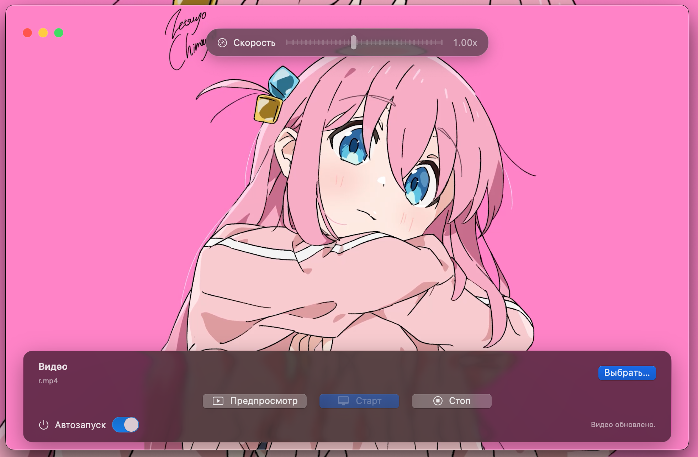

# AuraFlow for macOS

<p align="center">
  
</p>

AuraFlow — живые обои для macOS: демон на Python и GUI на AppKit + SwiftUI. Интерфейс скрывается при бездействии, позволяет выбрать видео, задать скорость воспроизведения, мгновенно обновить системные обои и управлять автозапуском демона.

## 👋 Быстрый старт
- **Готовый установщик**: скачайте `dist/AuraFlow.dmg`, смонтируйте образ и перетащите `AuraFlow.app` в `/Applications`.
- **Сборка из исходников**: выполните `./build_app.sh` — в `dist/` появятся `.app`, `.zip` и `.dmg`.

## Архитектура
- `python/` – демон `wallpaper_daemon.py`, менеджер `control.py`, вспомогательные модули и тесты.
- `macOSApp/` – SwiftUI-приложение (Swift Package) с Objective-C bridge `PythonBridge`.
- `build_app.sh` / `scripts/build_release.sh` – сборка `.app`, упаковка зависимостей и ресурсов для дистрибуции.

## Возможности интерфейса
- Клиентская декорация окна: скрытый стандартный title bar, полупрозрачный интерфейс с blur-эффектом.
- Кастомные системные кнопки управления (красная/жёлтая/зелёная) поверх видео.
- Предпросмотр выбранного видео на весь экран с соотношением сторон основного дисплея.
- Выбор видеоролика и мгновенная установка первого кадра как системных обоев macOS.
- Управление скоростью воспроизведения (0.25x – 2x), запуск/остановка демона, автозапуск через LaunchAgent.

## Требования
- macOS 13+.
- Xcode 15+ (для сборки Swift-проекта) или Swift toolchain 5.9+.
- Python 3.9+ с установленными фреймворками PyObjC (проверяется при запуске GUI через Objective-C bridge).

## Установка зависимостей (ручной запуск Python-демона)
```bash
python3 -m venv .venv
source .venv/bin/activate
pip install -r python/requirements.txt
python3 python/control.py start --video /path/to/video.mp4 --speed 1.0
```

## Готовый DMG
Скрипт сборки формирует готовый установщик:

```bash
./build_app.sh
```

В каталоге `dist/` окажутся:
- `AuraFlow.app` — собранное приложение;
- `AuraFlow.zip` — архив, если нужно отправить пакет по почте;
- `AuraFlow.dmg` — образ диска для конечных пользователей.

Чтобы установить приложение из `.dmg`, пользователю достаточно открыть образ, перетащить `AuraFlow.app` в папку `Applications` и запустить его (при первом старте macOS может запросить подтверждение для приложения от неизвестного разработчика).

> Примечание: перед сборкой положите иконку `Resources/AppIcon.png` (768×768) или заранее подготовленный `Resources/AppIcon.icns` — скрипт автоматом сгенерирует `.icns`, если есть PNG.

## Запуск SwiftUI-клиента из исходников
```bash
cd macOSApp
swift run
```
При запуске из исходников UI смотрит на скрипты в каталоге `python/`. Можно указать путь явно:
```bash
PYTHON_CONTROL_PATH=/absolute/path/to/python/control.py swift run
```

## Тестирование
Тесты разделены на Python и Swift-части:
- `python/tests/` (`unittest`) — запуск/остановка демона, смена видео и установка обоев, автозапуск.
- `macOSApp/Tests/` (`XCTest`, компилируется при наличии полноценного Xcode) — проверка клиентской декорации окна и предпросмотра.

Запуск Python-тестов:
```bash
python3 -m unittest discover -s python/tests
```

Запуск Swift-тестов (требуется установленный Xcode с XCTest):
```bash
cd macOSApp
swift test
```

## Настройка автозапуска
В UI переключите «Автозапуск при старте системы» или используйте CLI:
```bash
python3 python/control.py set-autostart on
```
Будет создан LaunchAgent `~/Library/LaunchAgents/com.example.auraflow.plist`.

## Диагностика
- Логи демона: `~/Library/Application Support/AuraFlow/daemon.log`.
- PID-файл: `~/Library/Application Support/AuraFlow/daemon.pid`.
- Конфигурация: `~/Library/Application Support/AuraFlow/config.json`.
