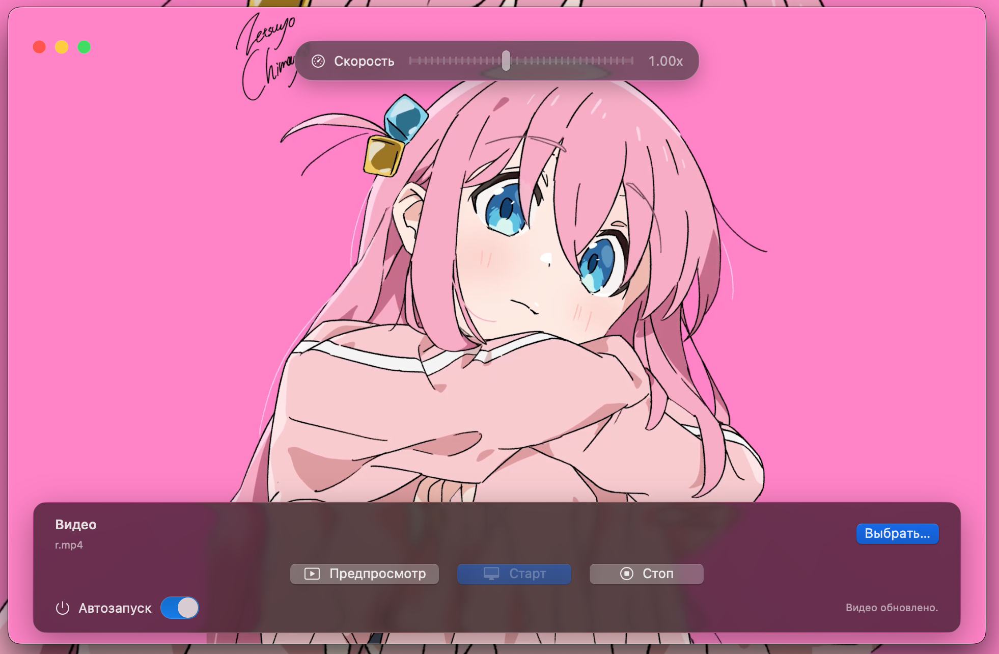

# AuraFlow for macOS

<p align="center">
  
</p>

AuraFlow is a live wallpaper app for macOS. It lets you play video wallpapers on the desktop, browse and download wallpapers from the built-in catalog, control playback in real time, and restore the user's previous non-AuraFlow wallpaper when live playback is removed.

## What You Can Do

- Apply your own local video as a live wallpaper.
- Preview a wallpaper before starting playback.
- Browse the built-in wallpaper catalog and download wallpapers directly inside the app.
- Reopen wallpapers from the downloaded library without downloading them again.
- Change playback speed from the floating speed control.
- Choose how the wallpaper fits the screen with `Fill`, `Fit`, or `Stretch`.
- Pause playback automatically when a fullscreen app is active.
- Launch AuraFlow at login.
- Optimize videos for playback compatibility on macOS.
- Monitor the wallpaper daemon from the built-in monitoring panel.
- Remove the live wallpaper and restore the user's latest non-AuraFlow wallpaper.

## Main Features

### Live Wallpaper Playback
AuraFlow runs a desktop wallpaper daemon built with Python and PyObjC. It creates one wallpaper window per display, plays the selected video in a loop, and keeps playback settings in sync with the SwiftUI control app.

### Built-In Wallpaper Catalog
AuraFlow includes an integrated catalog for browsing live wallpapers. Users can open a wallpaper detail view, preview it, download it, apply it, and reopen the source page when needed.

### Downloaded Wallpapers Library
Downloaded wallpapers are stored locally and shown inside the app, so users can quickly switch between previously downloaded wallpapers without repeating the download flow.

### Playback Controls
Users can:

- start and stop live playback;
- change playback speed;
- switch scale mode;
- enable or disable blend interpolation;
- pause automatically for fullscreen apps;
- enable launch at login.

### Video Optimization
AuraFlow can optimize videos for better macOS playback compatibility. Depending on the source codec and the Mac's hardware capabilities, the app can keep the source video, transcode it, or use optional ffmpeg-based conversion paths.

### Wallpaper Restore Logic
When AuraFlow starts, it saves the user's current non-AuraFlow wallpaper state. When the user removes the live wallpaper, AuraFlow restores that previous wallpaper instead of leaving a frozen AuraFlow frame behind.

## System Requirements

- macOS 13 or later
- Apple Silicon or Intel Mac
- Internet connection for wallpaper catalog downloads

Optional:

- `ffmpeg` for WebM/AV1 and some advanced video conversion paths
- macOS 26 or later for the Liquid Glass visual effect

## Install

### Download a Release

1. Download the latest `AuraFlow.dmg` from GitHub Releases.
2. Open the DMG.
3. Drag `AuraFlow.app` into `/Applications`.
4. Launch the app.

### Build from Source

```bash
PYTHON_BUILD_PYTHON=/usr/bin/python3 ./build_app.sh
```

The build output is created in `dist/`:

- `dist/AuraFlow.app`
- `dist/AuraFlow.zip`
- `dist/AuraFlow.dmg`

## First Launch

On first use, macOS may ask for permission to let AuraFlow control desktop wallpaper-related system actions. If wallpaper restore or desktop updates do not work correctly, check the app's Automation permissions in System Settings.

## Usage

### Use Your Own Wallpaper

1. Open AuraFlow.
2. Click `Change Wallpaper...`.
3. Select a local video.
4. Preview it.
5. Press `Start`.

### Use the Wallpaper Catalog

1. Open `Wallpaper Catalog`.
2. Choose a wallpaper.
3. Click `Download & Apply` or download it and reopen it later from `Downloaded Wallpapers`.

### Restore the Previous Wallpaper

- Press `Remove`.

AuraFlow will stop playback and restore the user's latest non-AuraFlow wallpaper snapshot.

## Playback Settings

AuraFlow includes settings for:

- Launch at Login
- Auto-Pause on Fullscreen Apps
- Blend Interpolation
- Scale Algorithm
- Video Optimization
- Optimization Profile

The exact behavior of AV1 and HEVC optimization depends on the Mac's hardware decode support.

## Project Structure

- `macOSApp/` — SwiftUI/AppKit desktop app and Python bridge
- `python/` — wallpaper daemon, control CLI, wallpaper utilities, and tests
- `scripts/build_release.sh` — release build and packaging script
- `docs/` — documentation assets

## Development

### Run Tests

Python:

```bash
python3 -m unittest discover -s python/tests
```

Swift:

```bash
cd macOSApp
swift test
```

### Build a Universal App

```bash
BUILD_UNIVERSAL=1 PYTHON_BUILD_PYTHON=/usr/bin/python3 ./build_app.sh
```

## Troubleshooting

### The build looks stuck after Swift finishes
The packaging step installs vendored Python dependencies. That can take time and is expected.

### Some catalog wallpapers fail to prepare
Some catalog sources are only available as `webm` or AV1. AuraFlow now prefers direct `mp4` sources when available, but some wallpapers still require `ffmpeg` for compatibility conversion. Install it with `brew install ffmpeg` if those sources fail to apply.

### The GitHub release works on one Mac but not another
Release artifacts must be built as a universal app. The release workflow now fails if the `x86_64` slice is missing, instead of silently publishing an Apple Silicon only bundle.

### Liquid Glass is missing
Liquid Glass is only available on macOS 26 or later. Older macOS versions use the fallback interface.

## License

This project is open source under the MIT License.

Copyright (c) 2026 mkkitsune
